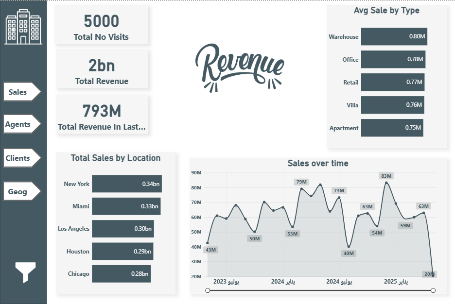
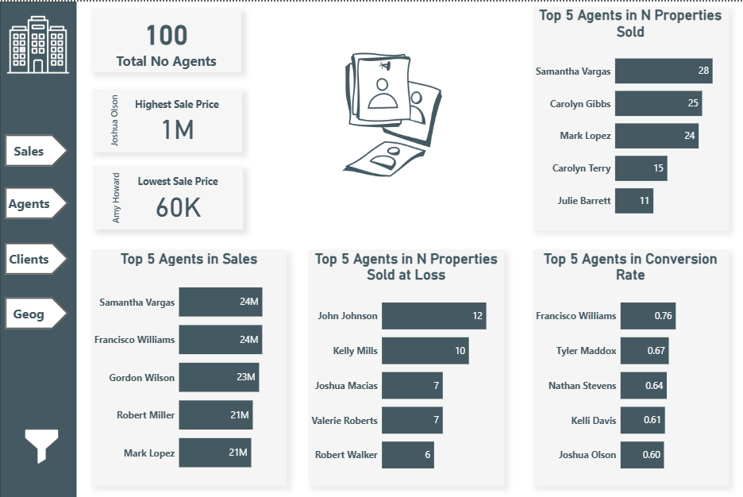
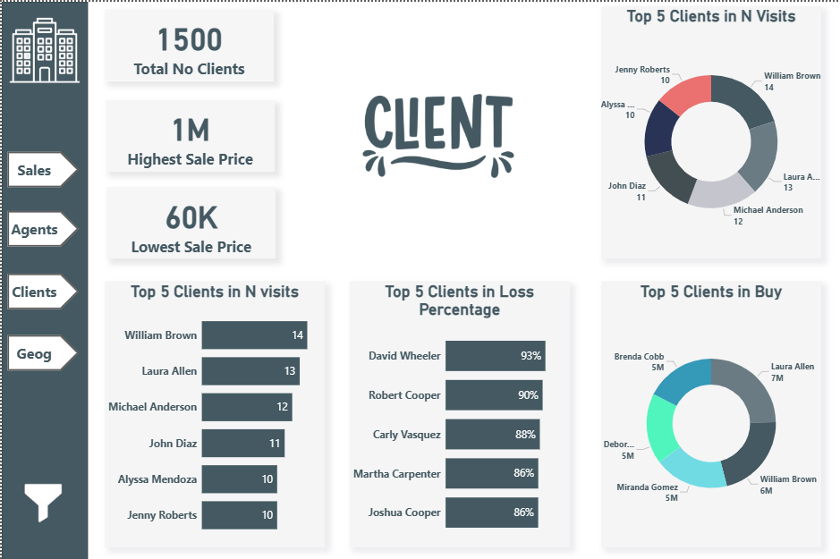
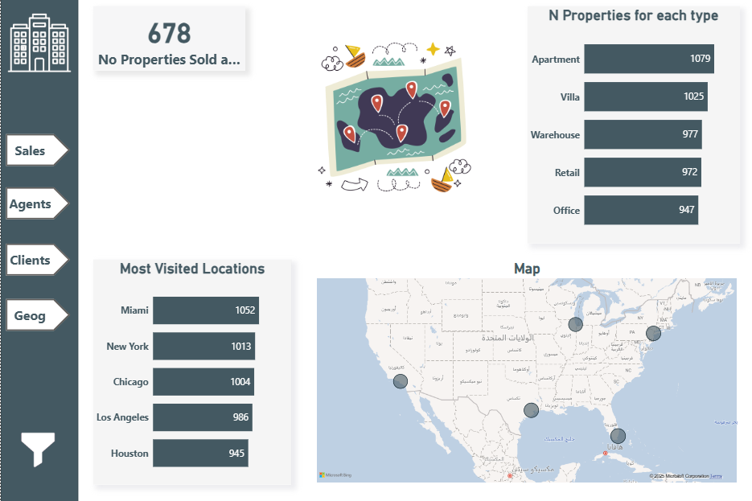

# Real Estate Sales Dashboard

## 📌 Project Overview

This project aims to build a **Power BI dashboard** for analyzing **real estate property sales**. The dashboard provides
actionable insights into property performance, agent efficiency, client behavior, and overall business revenue.

## 🏗️ System Model

**1. Input (Data Sources):**

* Property Sales Data
* Client Data
* Agent Data
* Property Visits Data
* Date Table (generated for time-based analysis)

**2. Process (Data Handling & Analysis):**

* **Data Connection** → Connect to multiple data sources.
* **Data Understanding** → Review tables, columns, and business goals.
* **Data Cleaning** → Handle missing, duplicate, and incorrect values.
* **Data Modeling** → Build relationships & create a Date Table.
* **Data Analysis** → Apply DAX measures to answer business questions such as sales performance, revenue trends, and
  property visits.

**3. Output (Dashboard & Insights):**

* **KPIs & Cards**: Total revenue, number of properties sold, number of clients, agents, and visits.
* **Charts & Visuals**:

    * Average sale price by property type
    * Conversion rate from visits to sales per agent
    * Average visits per client
    * Loss percentage when properties sold below listing price
* **Ranking & Highlights**:

    * Top 5 Performing Agents
    * Most Visited Property Type
    * Highest & Lowest Sale Price

## 🎯 Key Business Questions Answered

* How many properties were sold?
* What is the total revenue from property sales?
* What is the average sale price per property type?
* What is the conversion rate from visits to sales per agent?
* What is the loss percentage when a property is sold for less than listed?
* What is the total revenue generated in the last year?
* Plus additional KPIs like Top Agents, Most Visited Property Type, etc.

## 🖥️ Dashboard Features

* Multi-page design (at least 2 pages).
* User-friendly navigation with buttons and icons.
* Clean layout with consistent fonts, spacing, and colors.
* Combination of **cards, charts, and tables** for clear storytelling.

## 📷 Dashboard Screenshots

Below are some sample views from the Power BI dashboard:

### 🔹 Page 1: Sales Overview

### 🔹 Page 2: Agent Overview

### 🔹 Page 3: Clients Overview

### 🔹 Page 4: Geography Overview

## 📊 Tools Used

* **Power BI** – For data modeling, DAX calculations, and dashboard design.
* **DAX** – For custom measures and advanced analytics.
